# acorn2021_semiproject
에이콘아카데미 세미프로젝트 JSP 웹사이트

Eclipse IDE 2020-03 (4.15.0)

Apache 8.5

# 실행
프로젝트 import 후 facets 설정에서 에러가 난다면.

아래 세번째 부분 클릭하여

directory 경로를 /WebContent 입력해주고 ok
그리고 java build path 에서 아래 두가지 라이브러리를 추가

# 메인페이지

# 사이트 소개

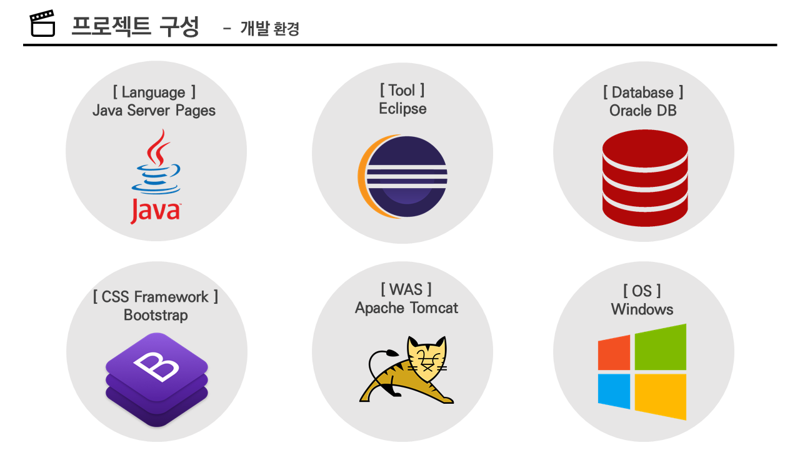
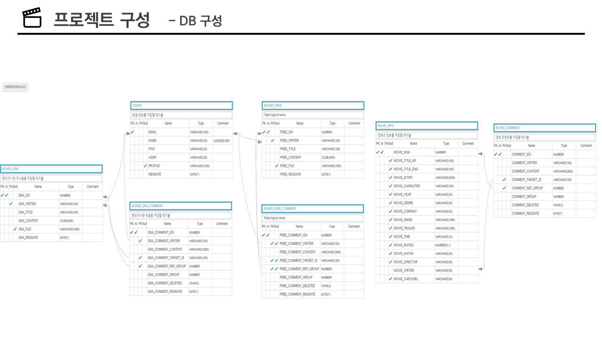
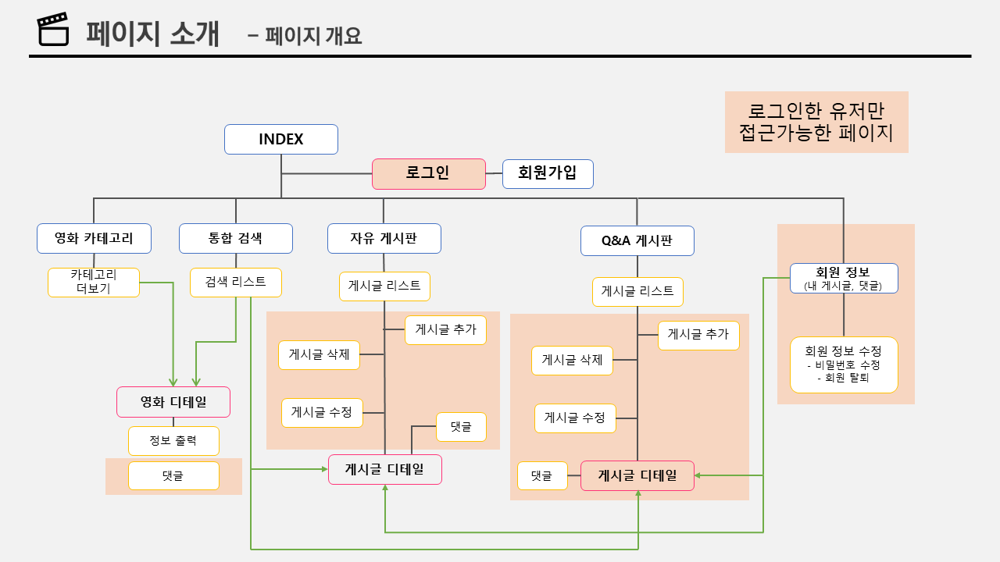

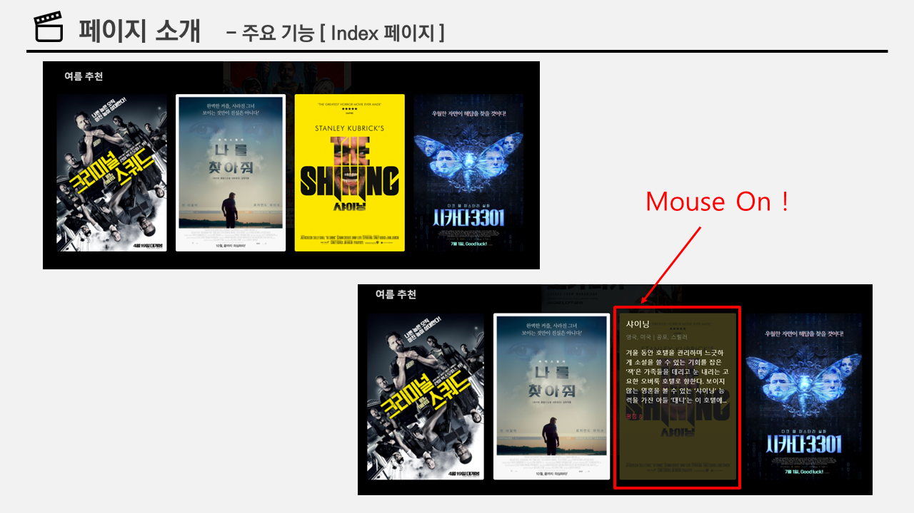
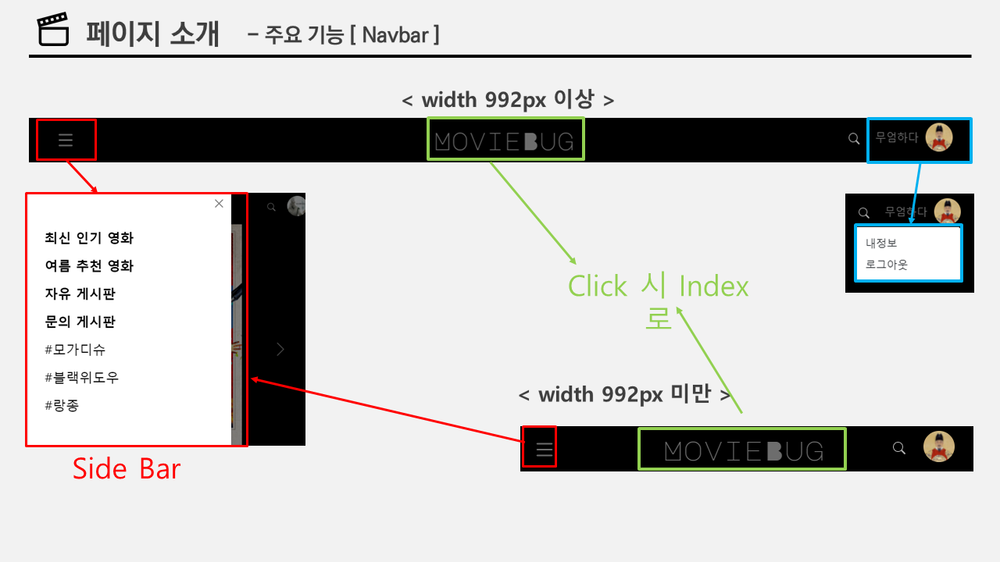
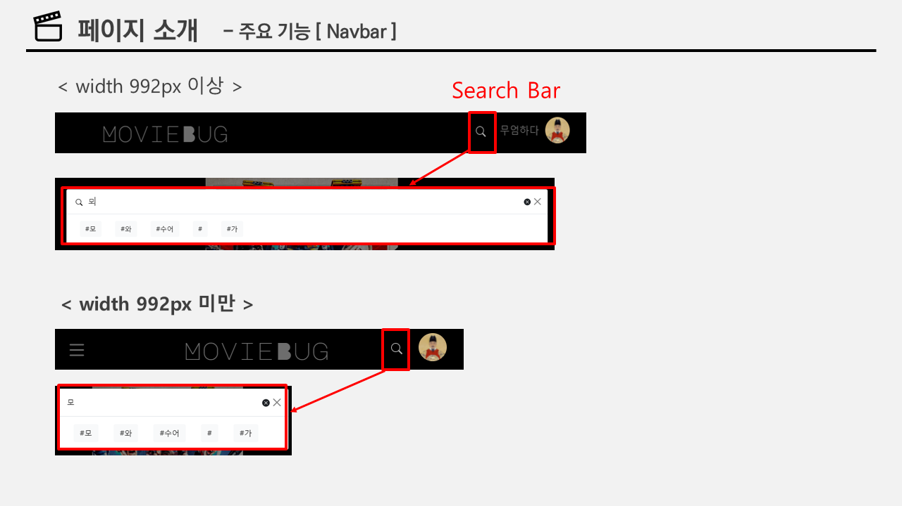
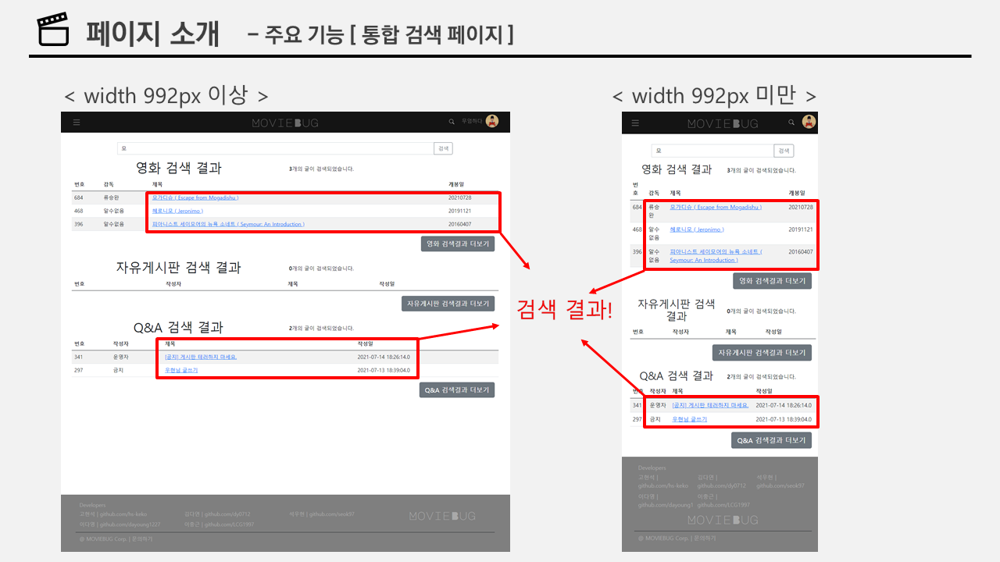
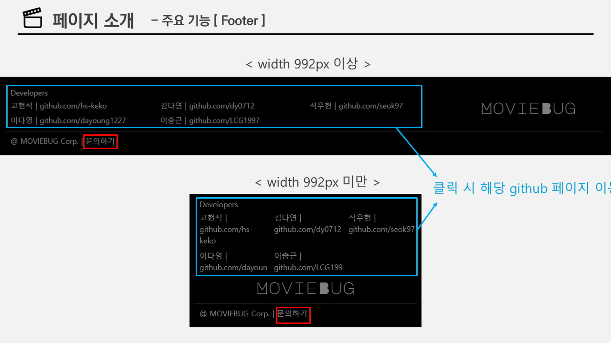
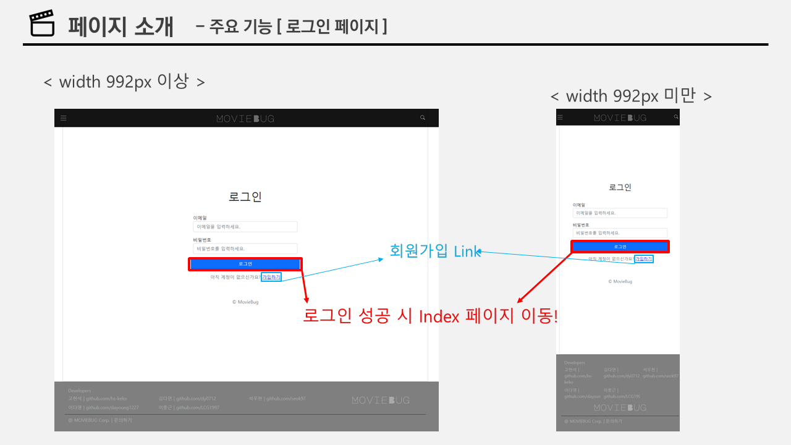
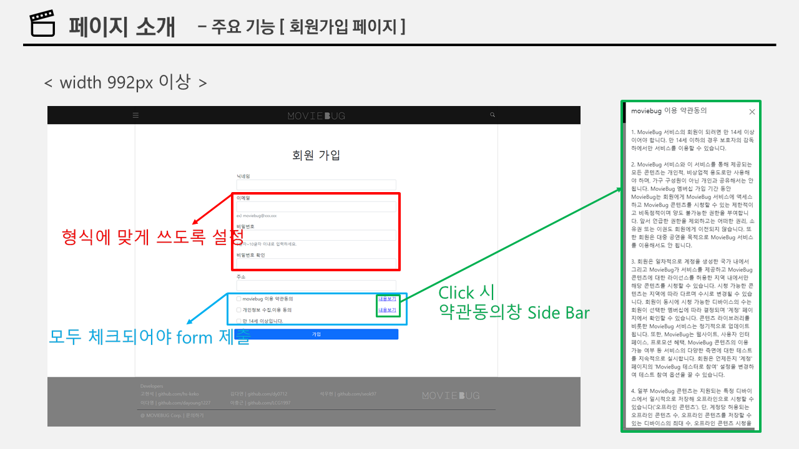
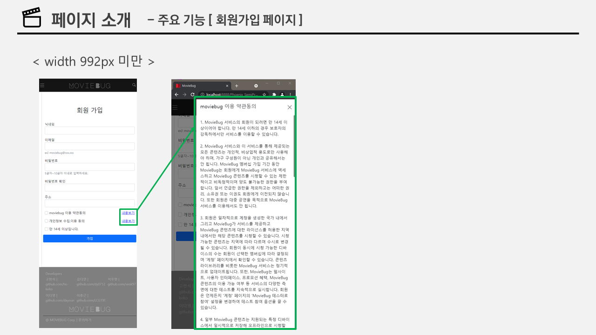
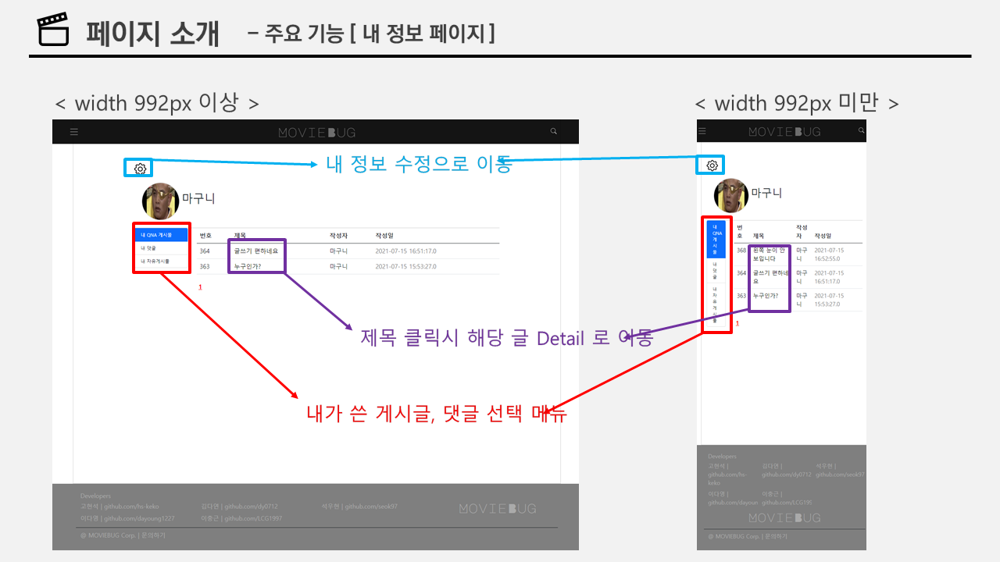
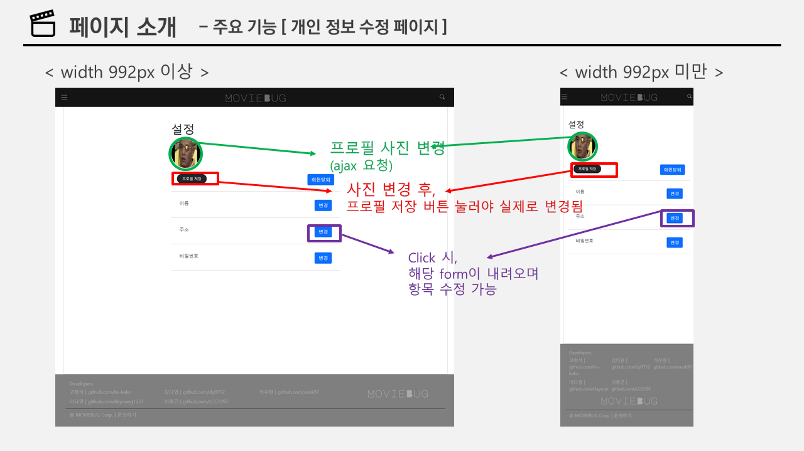

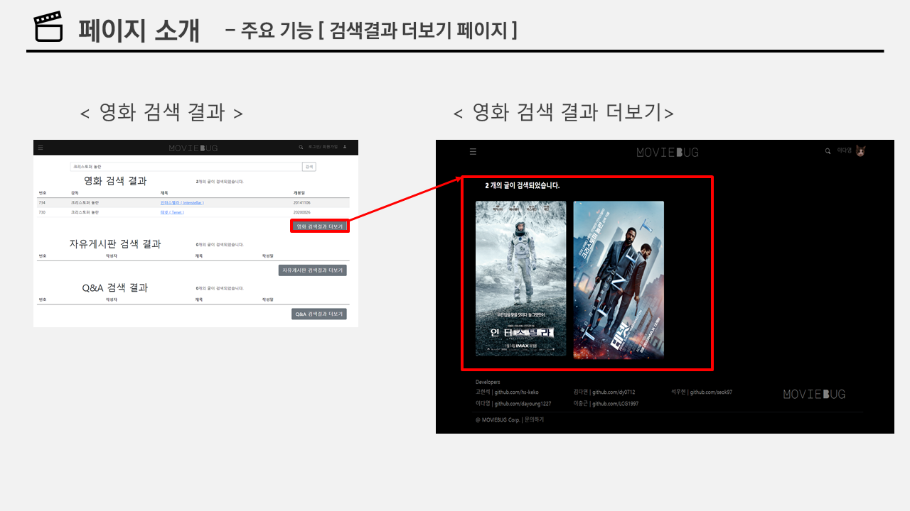

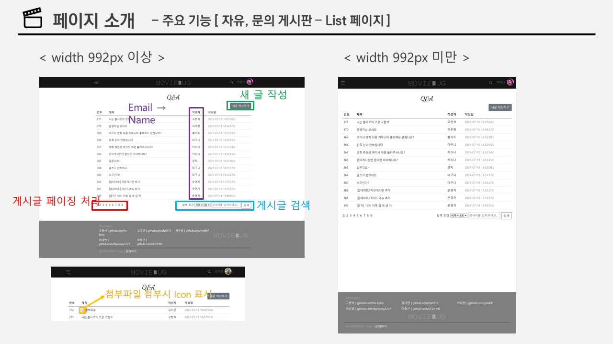
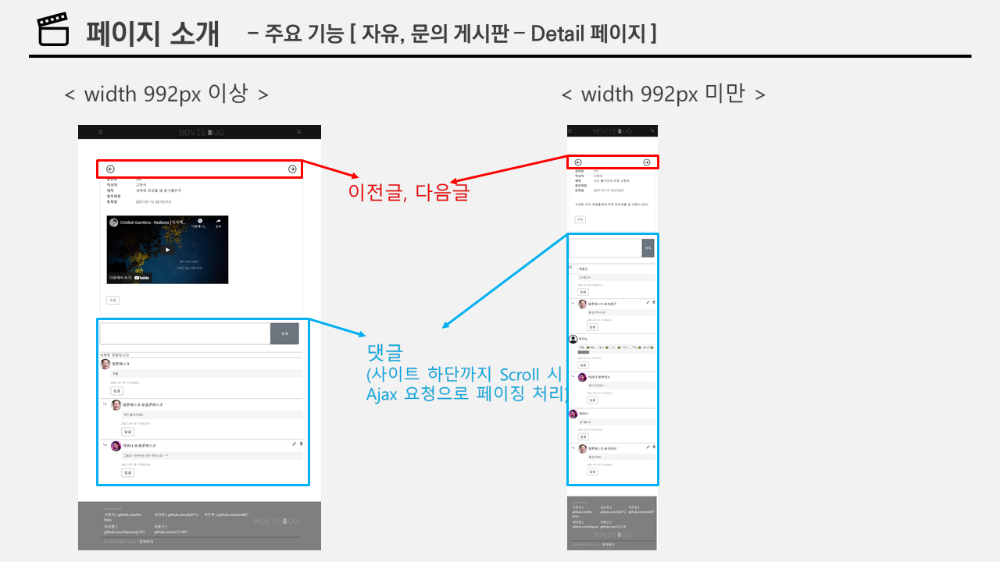
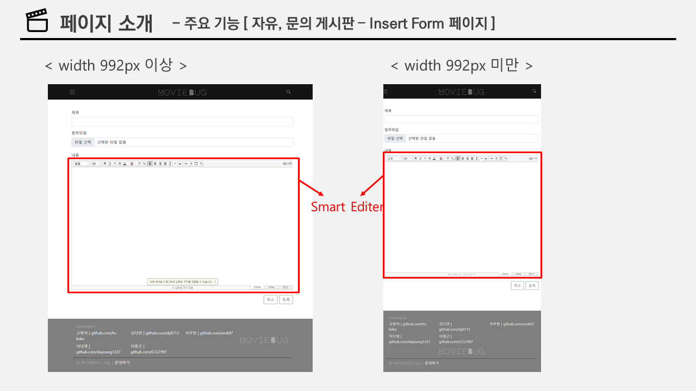
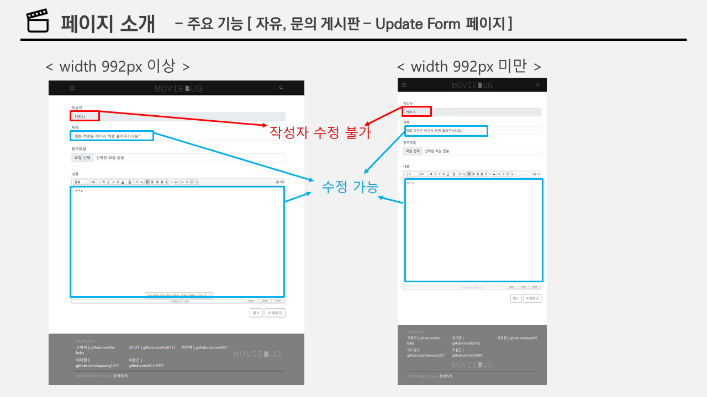

